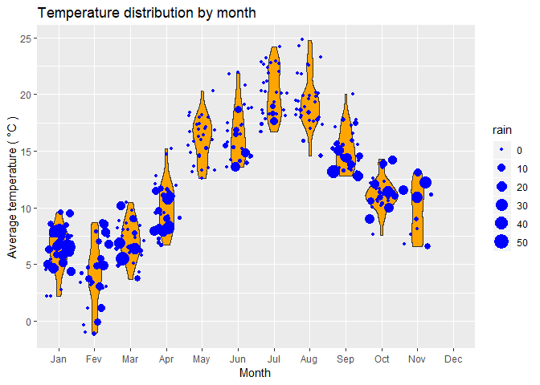

<!-- README.md is generated from README.Rmd. Please edit that file -->
Raincouver
==========

`Raincouver` is a package that allows you to easily obtain, process,
analyse and generate awesome plots with weather data of vancouver. Here
are things you can do:

-   Get daily weather data from a certain year
-   Do some analyses with data, like counting rainy days.
-   Generate awesome plots yearly climate summary.
-   Play with built-in dataset `raincouver10` contains weather data from
    2010-01-01 to 2018-12-31.

Install
-------

The package is on my github now, so it is easier to install by:

``` r
devtools::install_github("liao02x/raincouver")
#> Skipping install of 'raincouver' from a github remote, the SHA1 (2988a949) has not changed since last install.
#>   Use `force = TRUE` to force installation
```

Example
-------

Here are some basic examples:

``` r
library(raincouver)
```

### Get data

With `get_data` you can easily access to daily weather data by year.
Defaultly you will get the data of year 2018.

``` r
df <- get_data()
knitr::kable(head(df))
```

|  year|  month|  day|  temp\_max|  temp\_min|  temp\_ave|  rain|
|-----:|------:|----:|----------:|----------:|----------:|-----:|
|  2018|      1|    1|        4.4|        0.0|        2.2|   0.0|
|  2018|      1|    2|        4.3|        0.0|        2.2|   0.0|
|  2018|      1|    3|        3.8|        1.6|        2.7|   0.0|
|  2018|      1|    4|        7.0|        2.0|        4.5|   0.0|
|  2018|      1|    5|        9.9|        6.1|        8.0|  30.4|
|  2018|      1|    6|        8.9|        6.3|        7.6|   3.0|

### Do some analyses

There is some built-in functions in `raincouver` help to make data
analyses easier.

`count_rainy` can count rainy days in weather data. Use `rf` argument to
specify how much precipitation it needs to be a rainy day. Defaultly
`rf` is set to `10mm`.

``` r
count_rainy(df)
#> [1] 43
count_rainy(df, 1)
#> [1] 107
```

### Generate plots

With `plot_climate` function, you can easily summarise the climate
infomation of a year.

``` r
plot_climate(df)
#> Warning: Removed 56 rows containing non-finite values (stat_ydensity).
#> Warning: Removed 56 rows containing missing values (geom_point).
```



### Play with `raincouver10`

A built-in dataset for convenience.

``` r
knitr::kable(summary(raincouver10))
```

|     |     year     |      month     |      day      |   temp\_max   |    temp\_min   |   temp\_ave  |      rain      |
|-----|:------------:|:--------------:|:-------------:|:-------------:|:--------------:|:------------:|:--------------:|
|     |  Min. :2010  |  Min. : 1.000  |  Min. : 1.00  |  Min. :-2.50  |  Min. :-6.300  |  Min. :-4.4  |  Min. : 0.000  |
|     | 1st Qu.:2012 | 1st Qu.: 4.000 | 1st Qu.: 8.00 | 1st Qu.: 9.10 | 1st Qu.: 4.700 | 1st Qu.: 7.0 | 1st Qu.: 0.000 |
|     | Median :2014 | Median : 7.000 | Median :16.00 | Median :13.80 | Median : 8.200 | Median :11.0 | Median : 0.200 |
|     |  Mean :2014  |  Mean : 6.523  |  Mean :15.73  |  Mean :14.55  |  Mean : 8.406  |  Mean :11.5  |  Mean : 4.497  |
|     | 3rd Qu.:2016 | 3rd Qu.:10.000 | 3rd Qu.:23.00 | 3rd Qu.:20.00 | 3rd Qu.:12.700 | 3rd Qu.:16.3 | 3rd Qu.: 5.200 |
|     |  Max. :2018  |  Max. :12.000  |  Max. :31.00  |  Max. :31.50  |  Max. :19.700  |  Max. :24.8  |  Max. :73.200  |
|     |      NA      |       NA       |       NA      |   NA’s :250   |    NA’s :222   |   NA’s :253  |    NA’s :327   |
